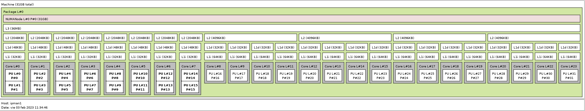

# Instructions Counter x86_64

## Author

* Manel Lurbe Sempere (malursem@gap.upv.es)

## Readme Content
-----

<!--ts-->
* [Content](#Readme-Content)
    1. [Abstract](#1-Abstract)
    2. [Test System](#2-Test-System)
    3. [Install Requisites](#3-Install-Requisites)
    4. [Install the benchmarks](#4-Install-the-benchmarks)
    5. [Install compile and run the Manager](#5-Install-compile-and-run-the-Manager)
    6. [Instructions to C array](#6-Instructions-to-C-array)
<!--te-->

## 1. Abstract

This program counts the number of instructions an application executes on a given time in seconds for the CPU where is executed. Compatible with Intel Hybrid CPUs.

## 2. Test System

- Intel Core i9 13900K
- WD Black SN770 SSD 500GB NVMe PCIe Gen4
- Antec P101 Silent
- Mars Gaming MPB1000 GOLD 80+
- MSI PRO Z690-A DDR5 ATX LGA1700
- DDR5 32gb x2 4800MT/s
- Ubuntu 22.04 LTS
- Linux Kernel 6.3.1-060301-generic

## 3. Install Requisites

- Install pre-requisites.
    ```
    sudo apt update && sudo apt upgrade
    sudo apt install gcc g++ build-essential cpufrequtils
    ```
- To run a 32-bit executable file on a 64-bit multi-architecture:
    ```
    sudo dpkg --add-architecture i386
    sudo apt-get update
    sudo apt-get install libc6:i386 libncurses5:i386 libstdc++6:i386
    sudo apt-get install multiarch-support
    ```

- Check available processor cores in your system, type this command and you will find.
    ```
    nproc
    ```
    For me the output was:
    ```
    32
    ```
    This means that I have 32 processor cores from 0 to 31.

- Check maximum cpu frequency of your processor cores that allows you to control manually for each core.
    ```
    cpufreq-info
    ```
    You will find something like this, that is auto explanatory:
    ```
    hardware limits: 800 MHz - 3.00 GHz
  
    available frequency steps: 
    3.00 GHz, 3.00 GHz, 2.80 GHz, 2.70 GHz, 2.50 GHz, 2.40 GHz, 2.20 GHz, 2.10 GHz, 1.90 GHz, 1.70 GHz, 1.60 GHz, 1.40 GHz, 1.30 GHz, 1.10 GHz, 1000 MHz, 800 MHz
    
    available cpufreq governors:
    conservative, ondemand, userspace, powersave, performance, schedutil
    
    current policy: 
    frequency should be within 800 MHz and 3.00 GHz.
    ```

- Check the processor topology in your system, type this command and you will find.

    Install lstopo program
    ```
    sudo apt install hwloc
    ```
    Run the program
    ```
    lstopo
    ```
    You will see something like this:
    

    This means that my test bench has:
    - 8 P-cores with SMT2 from threads 0 to 15
    - 16 E-cores without SMT from threads 16 to 31.

- Disable secure boot from the bios.

    Then you will be able to execute this lines without errors:
    ```
    sudo modprobe msr
    sudo wrmsr -p 0 0x1a4 0xF
    ```

- Disable intel_pstate on the kernel boot to control the frequency of the CPU.
    ```
    sudo nano /etc/default/grub
    ```
    Add the following line to the file:
    ```
    GRUB_CMDLINE_LINUX_DEFAULT="intel_pstate=disable"
    ```
    Then run the command:
    ```
    sudo update-grub
    ```
    Finally reboot the machine:
    ```
    sudo reboot
    ```

- Prepare the workspace.
    ```
    mkdir $HOME/working_dir/
    cd $HOME/working_dir/
    ```

- If needed, you can install the latest Linux kernel and the latest perf tool.
    - Install mainline.
        ```
        sudo add-apt-repository ppa:cappelikan/ppa
        sudo apt update
        sudo apt install mainline
        ```
    - Or build it from source.
        ```
        sudo apt install libgee-0.8-dev libjson-glib-dev libvte-2.91-dev valac aria2 lsb-release make gettext dpkg-dev
        git clone https://github.com/bkw777/mainline.git
        cd mainline
        make
        sudo make install
        ```
    - Install the latest Linux Kernel with mainline.
        ```
        sudo mainline --install 6.3.1
        sudo reboot
        ```
    - Get Linux source, compile and install the latest perf tool.
        ```
        wget https://cdn.kernel.org/pub/linux/kernel/v6.x/linux-6.3.1.tar.xz
        tar -Jxf linux-6.3.1.tar.xz
        cd linux-6.3.1/tools/perf/
        make
        sudo cp perf /usr/bin/
        ```
    - Check perf tool version and available events on the system with perf.
        ```
        sudo sh -c 'echo -1 > /proc/sys/kernel/perf_event_paranoid' .
        perf --version
        sudo modprobe msr
        perf list >> available_events.txt
        ```

- Install libpfm4 library.
    ```
    cd $HOME/working_dir/
    git clone https://github.com/wcohen/libpfm4.git
    cd libpfm4/
    make
    sudo make install
    ```

- Check performance events available on the system for lipfm4.
    ```
    cd $HOME/working_dir/libpfm4/examples
    make all
    ./showevtinfo >> available_events.txt
    ```
    This will save the available system performance events on a plain text file.

[Back to top](#Readme-Content)

## 4. Install the benchmarks

- Install SPEC CPU applications inside the workspace on the folders.
    ```
    $HOME/working_dir/spec2006-x86-bin/
    $HOME/working_dir/spec2017-x86-bin/
    ```

- Place SPEC CPU refence inputs inside the workspace on the folders.
    ```
    $HOME/working_dir/CPU2006/
    $HOME/working_dir/CPU2017/
    ```

- Install Geekbench5 inside the workspace on the folder.
    ```
    $HOME/working_dir/Geekbench-5.4.4-Linux/
    ```

- Install Gap benchmarks the workspace folder.
    ```
    $HOME/working_dir/benchmarks/gaps/
    ```

- Add, modify or delete benchmark and their paths if needed inside the file src/{bench}_benchmarks.h

[Back to top](#Readme-Content)

## 5. Install compile and run the Manager

- Clone the repo inside the workspace.
    ```
    cd $HOME/working_dir/
    git clone https://github.com/mlurbe97/Instructions-Counter-x86_64.git
    ```

- Compile the scheduler.
    ```
    cd $HOME/working_dir/Instructions-Counter-x86_64/
    chmod +x build.sh
    ./build.sh -b {bench}_BENCHMARKS
    ```
- Run the scheduler.
    ```
    cd $HOME/working_dir/
    sudo ./run_{bench}.sh -k core_type [0->P_core 1->E_core] -t time [Number in seconds] -w workloadArray [{bench}] -c num_cores -f cpu_freq [default=3.00 GHz] s-> selected_workload [{bench}]
    ```

[Back to top](#Readme-Content)

## 6. Instructions to C array

Program [src/instructions_to_C_array.py](src/instructions_to_C_array.py) converts the output instructions from the main program extracted for each benchmark to a C array, useful to use with my implementations of Linux Schedulers.

[Back to top](#Readme-Content)